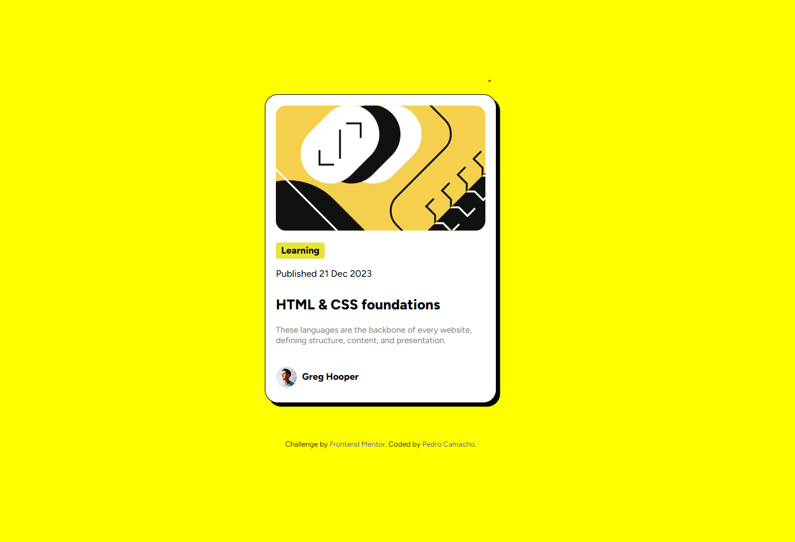

# Frontend Mentor - Blog preview card

## Welcome! 👋

Thanks for checking out this front-end coding challenge.

For this challenge, I needed to recreate a blog card. It was a fun and challenging project. 

## The challenge

Your challenge is to build out this blog preview card and get it looking as close to the design as possible.

You can use any tools you like to help you complete the challenge. So if you've got something you'd like to practice, feel free to give it a go.

Using HTML and CSS, I was able to complete the design as close as I could. As well as adding a couple of different things. Overall, I believe it turned out pretty good.

### Screenshot

This is a sscreenshot of my solution. I tried to make it as close as possible to the solution.

This is the solution Frontend Member provided.

### Links

- Live Site URL: (https://machocamacho1.github.io/Blog-Preview-Card/)

## My process

To begin, as I always do, I tried to seperate each element to organize myself and my vision on how it should turn out. Once I have set everything I need, I begin styling with CSS. 

### Built with

HTML
CSS

## Author

- Frontend Mentor - [@MachoCamacho1](https://www.frontendmentor.io/profile/MachoCamacho1)
